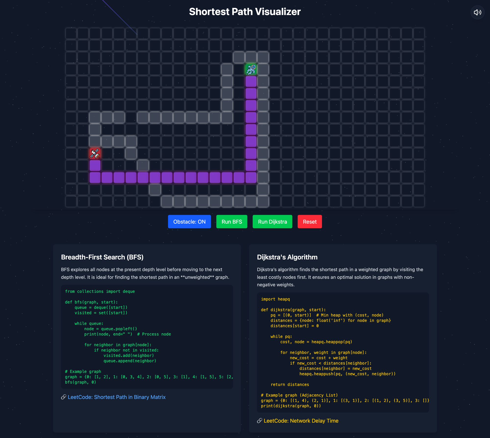
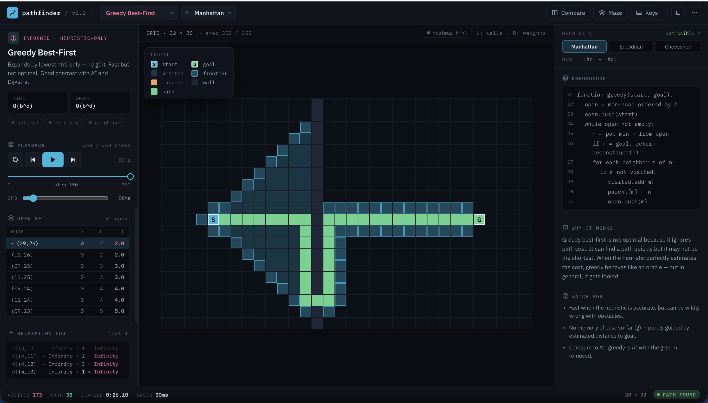

# Shortest Path Visualizer

A pathfinding algorithm visualizer built with React, TypeScript, and styled-components. Step through algorithms frame-by-frame, compare two algorithms side-by-side, generate mazes, and learn how each algorithm works — all in a clean dark-themed UI.

---

## Version Comparison

| | V1 | V2 |
|---|---|---|
| **Stack** | React + Tailwind CSS | React + TypeScript + styled-components |
| **Algorithms** | BFS, Dijkstra | BFS, Dijkstra, A\*, Greedy Best-First, DFS, Bidirectional BFS |
| **Controls** | Run only | Step-by-step, play/pause, speed control |
| **UI theme** | Cosmic (stars, glow) | Minimal dark panel layout |
| **Mazes** | None | Recursive Backtracker, Prim's, Kruskal's, Sidewinder, Binary Tree |
| **Learning** | None | Pseudocode panel, algorithm info, heuristic selector |
| **Compare** | None | Side-by-side dual-grid compare mode |
| **Mobile** | None | Bottom drawer, touch drawing, responsive layout |
| **Weights** | None | Weighted cells (brush 1–9), Dijkstra/A\* aware |

---

## Screenshots

### Version 1 — Cosmic Theme


### Version 2 — Clean Dark UI


---

## Features

### Algorithms
| Algorithm | Weighted | Optimal | Heuristic |
|---|---|---|---|
| BFS | No | Yes (unweighted) | No |
| Dijkstra | Yes | Yes | No |
| A\* | Yes | Yes | Yes |
| Greedy Best-First | Yes | No | Yes |
| DFS | No | No | No |
| Bidirectional BFS | No | Yes (unweighted) | No |

### Visualization Engine
- **Step-by-step playback** — pause at any frame, step forward or back
- **Variable speed** — 1× to 16× playback
- **Frame counter** — step N / total displayed in header
- **Stats drawer** — nodes visited, path length, time elapsed, memory usage
- **Heatmap overlay** — visualize h(n) distance-to-goal for A\* and Greedy

### Grid Interaction
- **Left-click drag** — draw walls
- **Right-click drag** — draw weighted cells
- **Shift + drag** — erase
- **Number keys 1–9** — set weight brush value
- **Drag start/end nodes** to reposition
- **Touch support** — draw walls and weights on mobile/tablet

### Maze Generators
- **Recursive Backtracker** — long winding corridors
- **Prim's** — branchy, even distribution
- **Kruskal's** — random spanning tree
- **Sidewinder** — horizontal bias
- **Binary Tree** — diagonal bias

### Compare Mode
- Side-by-side synchronized grids
- Same start/end/walls on both
- Run both simultaneously or independently
- Metrics comparison table after completion

### Learning Panel
- Algorithm description and complexity
- Live pseudocode with current line highlighted during playback
- Heuristic selector for A\* and Greedy (Manhattan, Euclidean, Chebyshev)

---

## Keyboard Shortcuts

| Key | Action |
|---|---|
| `Space` | Play / Pause |
| `←` / `→` | Step back / forward |
| `R` | Reset visualization |
| `C` | Clear grid |
| `M` | Open maze generator |
| `Enter` | Run algorithm |
| `1`–`9` | Set weight brush |
| `?` | Toggle keyboard shortcuts HUD |

---

## Getting Started

```bash
git clone https://github.com/arun-357/shortestPathVisualizer.git
cd shortestPathVisualizer
npm install
npm run dev
```

Open `http://localhost:5173` in your browser.

### Build for production

```bash
npm run build
npm run preview
```

---

## Project Structure

```
src/
├── algorithms/          # BFS, Dijkstra, A*, Greedy, DFS, Bidirectional
│   ├── bfs.ts
│   ├── dijkstra.ts
│   ├── astar.ts
│   ├── greedy.ts
│   ├── dfs.ts
│   ├── bidirectional.ts
│   └── heuristics.ts
├── components/
│   ├── algorithm/       # AlgorithmPanel, StepController, PseudocodePanel
│   ├── comparison/      # CompareMode (side-by-side dual grids)
│   ├── grid/            # Grid, Cell, GridControls (maze drawer)
│   ├── learn/           # InfoPanel (algorithm descriptions)
│   ├── metrics/         # MetricsBar (bottom status), StatsDrawer
│   └── ui/              # NavBar, Drawer, MobileBar, Icons, Primitives
├── constants/           # Algorithm metadata, pseudocode text
├── hooks/               # usePlayback, useGridInteraction
├── maze/                # Maze generator implementations
├── store/               # Zustand: gridStore, algorithmStore, uiStore
└── styles/              # theme.ts, breakpoints.ts, GlobalStyle
```

---

## Tech Stack

- **React 18** + **TypeScript**
- **styled-components v6** — all styling, theming via `DefaultTheme`
- **Zustand** — state management (grid, algorithm, UI)
- **Vite** — dev server and build

---

## Architecture

See [ARCHITECTURE.md](ARCHITECTURE.md) for a deep-dive into data flow, the generator-based step engine, store design, and component hierarchy.
